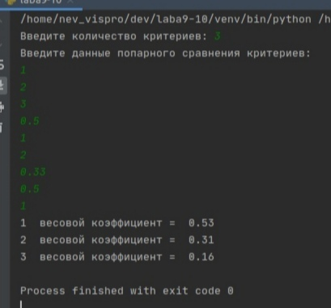

Данная программа расчитывает весовые коэффициенты критериев. 
Входные данные: количество критериев, данные попарного сравнения критериев. 
Выходные данные: весовые коэффициенты в виде 0.00

Проект можно открывать в среде программирования Pycharm. Файл написан на языке python. Открывать файл "laba9-10.py". 
